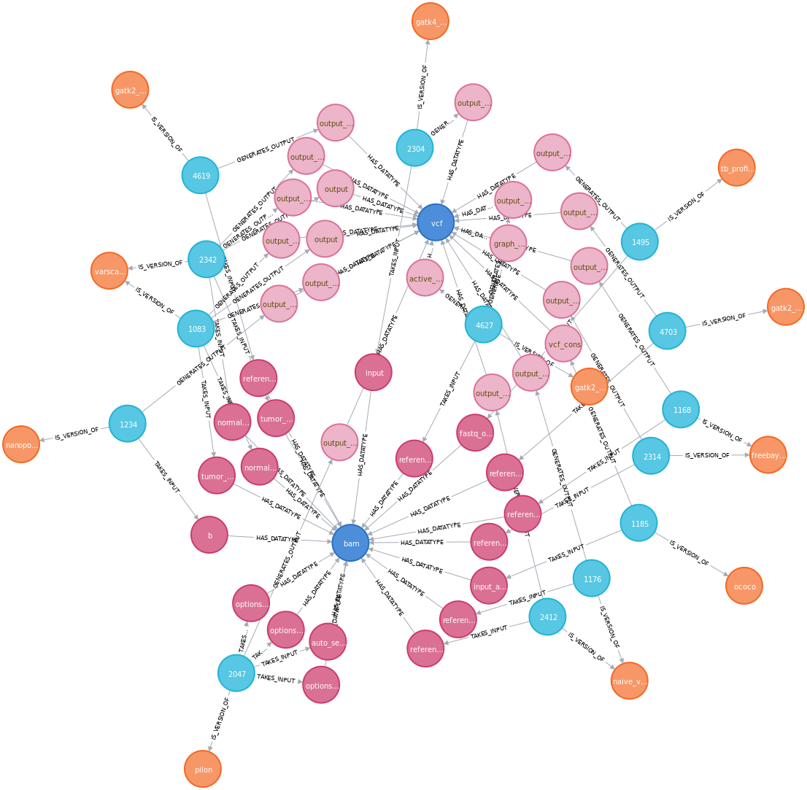

# A graph database of Galaxy tool interoperability

**Project Number:** 30

## Research area alignment

- ELIXIR Galaxy Community
 ELIXIR Tools platform, Tools and Services Registry, Workflows & Interoperability groups

## Team

- [Wolfgang Maier](https://github.com/wm75)
- [Anup Kumar](https://github.com/anuprulez)

## Expected outcomes

- a graph-based database of tools the traversal of which defines analysis workflows at various levels of tool interoperability confidence levels
- a public frontend for Galaxy instances for exploring networks of tools and suggesting possible workflows from analysis start and end points

## Expected audience

- Galaxy tool developers & Galaxy server admins for curated content development
- Bioinformatics operations ontologists (EDAM, bioschema) for automated content generation
- bio.tools ecosystem developers and experts
- Graph database developers for database layout and Galaxy users for query design
- Members of the Galaxy Working Group within the ELIXIR Tools Platform for integration into Galaxy

**Number of expected hacking days**: 4



## Setting up Neo4j

General neo4j reference:

https://neo4j.com/docs/developer-manual/3.2/introduction/

### Fast way using docker

1. `docker pull neo4j`

2. Create folder structure for storing neo4j database content, import data, and logs **outside the docker container**:
   ```
   cd $HOME &&
   mkdir neo4j neo4j/data neo4j/import neo4j/logs
   ```

3. Launch neo4j

   The command below will
   - make neo4j accessible via its http (port 7474) and bolt interfaces (port 7687)
   - make it store database data and logs in mapped locations outside the container and
   - look for import data in an external folder, too
   - have it act on behalf of the current user (so that you have regular access rights to the data in the mapped locations)
   
   ```
   sudo docker run \
   --publish=7474:7474 --publish=7687:7687 \
   --volume=$HOME/neo4j/data:/data --volume=$HOME/neo4j/import:/import --volume=$HOME/neo4j/logs:/logs \
   --user=`id -u`:`id -g` neo4j
   ```

4. Check availability of the database server in your browser at
   http://127.0.0.1:7474/browser/
   
Resources:
- https://neo4j.com/docs/operations-manual/current/docker/
- https://neo4j.com/developer/docker-run-neo4j/
- https://neo4j.com/developer/docker/

### Installation using OS package manager (Ubuntu):

1. Install java and check version
   - `sudo apt install default-jre`
   - `java --version`

2. Install Neo4j
   - `wget -O - https://debian.neo4j.org/neotechnology.gpg.key | sudo apt-key add -`
   - `echo 'deb https://debian.neo4j.org/repo stable/' | sudo tee -a /etc/apt/sources.list.d/neo4j.list`
   - `sudo apt-get update`
   - `sudo apt-get install neo4j=1:3.5.12`

3. Minimal configuration of neo4j
   - Uncomment the line `dbms.connectors.default_listen_address=0.0.0.0` in `/etc/neo4j/neo4j.conf`

4. Starting/Stopping the Neo4j database service
   - `sudo service neo4j start`
   - `sudo service neo4j stop`
   - `sudo service neo4j restart`

Resources:
- https://neo4j.com/docs/operations-manual/current/installation/linux/debian/#debian-installation
- https://dzone.com/articles/installing-neo4j-on-ubuntu-1604

### Use neo4j Desktop

https://neo4j.com/download/neo4j-desktop/?edition=desktop


## Installation of Python requirements

### Using Python3 venv
1. `python3 -m venv graph_db`
2. `. graph_db/bin/activate`
3. `pip install py2neo requests`

### Using conda
1. `conda create --name graph_db python=3.6`
2. `pip install py2neo`
3. `conda install requests`

## Building the graph database

### Copy data files to neo4j import directory
- For a OS package manager installed neo4j:
   
  `sudo cp data/* /var/lib/neo4j/import/`
      
- For neo4j running in docker:
   
  `cp data/* $HOME/neo4j/import`

### First connection to the database server
1. Visit http://127.0.0.1:7474/browser/ in your browser and log in with the default credentials:
   ```
   username: neo4j
   password: neo4j
   ```
     
2. Set a new password upon being prompted to do so
   
### Import the data
Find the file `run_create_db.sh` inside the cloned repo folder, and:

1. Edit it to use
   - the password you set for your database account
   - the paths to the CSV data files in the neo4j import directory (see above)
   
2. From inside the cloned repo folder run:
   
   `sh run_create_db.sh`

Building the database should take < 1 minute with an OS package manager-installed neo4j
(expect 1-5 minutes with the less performant docker version).

After that go back to the neo4j web interface and **start exploring**!
